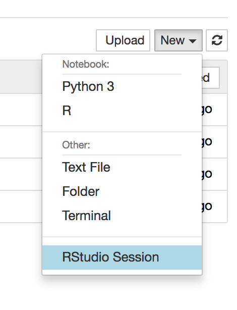

# Introduction to extreme value analysis in R

This repo contains interactive R scripts to introduce some key ideas in extreme value analysis, using stream discharge data from Boulder Creek as a case study. 

### Launching Binder

To get started, click the `launch binder` button above!

### Opening RStudio

Once you connect to your Jupyter session, use the drop down menu to start up a RStudio session: 

### Opening the activity

Once your RStudio instance is running, open up [`activity.Rmd`](https://github.com/mbjoseph/intro-eva/blob/master/activity.Rmd), 
which is an [R Notebook](https://rmarkdown.rstudio.com/r_notebooks.html). 

### Viewing the slides

The slides are available here: https://mbjoseph.github.io/intro-eva/slides.html

Source code can be found on the 
[`gh-pages`](https://github.com/mbjoseph/intro-eva/tree/gh-pages) branch of 
this repository.

*Thanks to the Binder team for developing the RStudio + Binder integration!* https://github.com/binder-examples/dockerfile-rstudio
